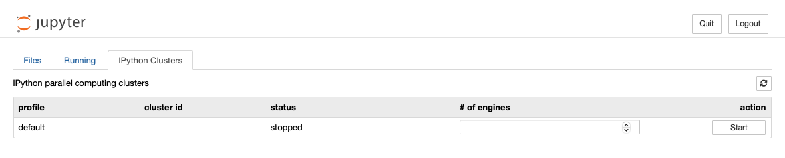
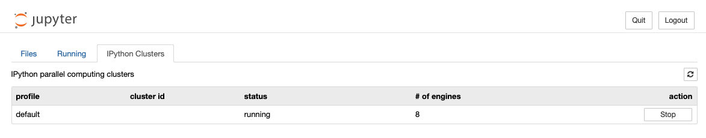

# Bodo Community Edition
This repository contains a dockerfile to create a bodo community edition image, enabling users to run applications in parallel with 8 cores for free. 

The image also contains two notebooks, one a Monte Carlo simulation to calculate the pi number. And another example that shows how to use BodoSQL and Bodo for Pandas and data transformation applications.


### Pre-requisits
- Before you start, make sure the latest version of docker is installed on your machine.
- You also need to run the Docker daemon (e.g., run the Docker Desktop).
- Log in if you want to push a new image to dockerhub. 

## Start the Bodo Community Edition

The bodo docker image is available at https://hub.docker.com/r/bodoaidocker/bodo-community-edition

You can follow the instruction there, or just continue reading here. 

All you need to do is to run the following command:
```shell
docker pull bodoaidocker/bodo-community-edition
```

Once the download is complete:
```shell
docker run -p 8888:8888 --cpus=8 bodoaidocker/bodo-community-edition
```

At the end of the output you will see a link like the one below, click (or copy paste it to your browser) and start playing :)

```shell
 http://127.0.0.1:8888/?token=7b48621b8f12...
```

In the browser, click on IPython Clusters tab, and then click on the Start button. This will start a cluster. 


This is what you expect to see after clicking on start button.


Enjoy!

## Stop the container
You can stop the container once you are done. 
1. Find the container id by running `docker ps`
2. Run `docker stop <container-id>`

If you want to review the list of docker images:
`docker image ls`


## Build the image from scratch locally

Alternatively, instead of downloading the image from dockerhub, you can create the image locally:
1. clone the repo from github
2. Change working directory to where the `Dockerfile` is saved on your machine
3. Run the following command:

```shell
docker build -t bodo-community-edition . 
```
Once the build is complete, you can run the container using the same command as above. 

```shell
docker run -p 8888:8888 --cpus=8 bodo-community-edition 
```

The output of docker run command tells you the http link to run jupyterlab. In contains a token and looks like this.
Just click on it or copy and paste it in your browser.  
Then follow the instruction given in the **Start the Bodo Community Edition** section
```shell
 http://127.0.0.1:8888/?token=7b48621b8f12...
```


## Build your bodo image and push to dockerhub
To push the image to dockerhub, you need to tag it with your account name as follows. 
Make sure you are logged in to Docker with your account credentials.


```shell
docker build -t <your-account-name>/bodo-community-edition .    
docker push <your-account-name>/bodo-community-edition  
```

Test if it works:
```shell
docker run -p 8888:8888 --cpus=8 bodo-community-edition 
```


## Troubleshooting
1. The code will not work if you have a very old docker installed. Upgrade to latest.
2. error:  `Can't add file <path>/img/cluster-starts.png to tar: io: read/write on closed pipe ` This error means you need to change the current directory to where the Dockerfile is saved. 
3. ERRO[0001] : `Cannot connect to the Docker daemon at unix:///Users/alireza/.docker/run/docker.sock. Is the docker daemon running?` 
This error means you did not run docker. As mentioned in prerequisites section, first run the docker. 
If that did not solve it, check the privileges [here](https://phoenixnap.com/kb/cannot-connect-to-the-docker-daemon-error).
