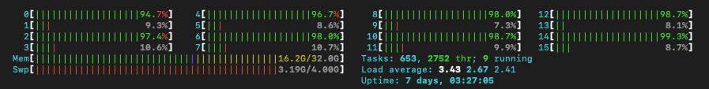

This module contains some examples using scikit-learn for machine learning project. 
To run the examples:

1- Make a new file called credentials.json. This file is gitignored so it will not be saved in git.
2- Put your aws access and secret keys in the following format and save:

```shell
cd Bodo-examples/ml
vim credentials.json
```
and paste the json text below and populate with your credentials.

```json
{
  "aws": {
    "aws_access_key_id": "--",
    "aws_secret_access_key": "--"
  }
}
```

Open any of the notebooks and run it.

Watch your [htop](https://formulae.brew.sh/formula/htop) in terminal and enjoy
all your CPU cores working hard on ML problems!

```shell
htop
```

This is an image of running credit-card-fraud.ipynb with 8 cores.

Happy bodoing!!!
