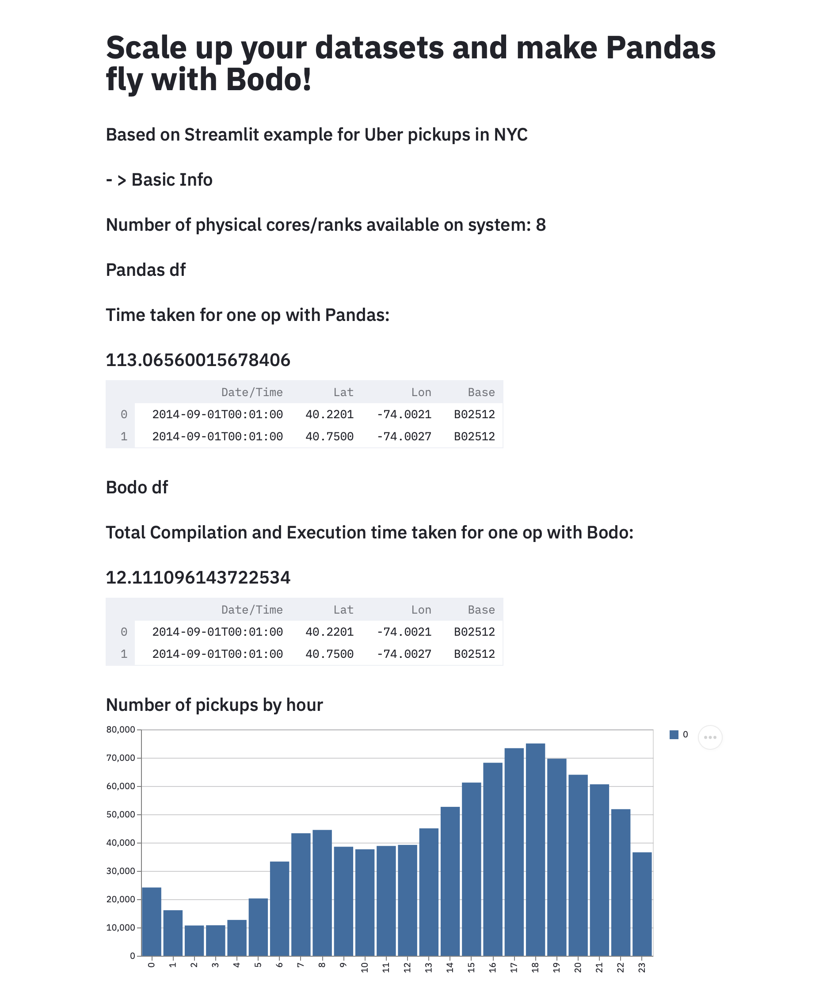

# Run Streamlit Apps with Bodo 

We have provided an ``environment.yml`` file to create a conda environment with all the required dependencies. The app code is stored in ``app.py``, and some configuration parameters such as the input file, and path to current directory
are set in ``config.py``. We have provided a sample parquet file ``sample_parquet_file.pq`` to test the app with.


---
**NOTE**

Please ensure that the path to current directory is set in the ``config.py`` file.

---

#### Start the IPyParallel controller and engines

- Create a conda environment from the provided ``environment.yml`` file,
and activate the conda environment:

```
    conda env create -f environment.yml
    conda activate stlbodo
```

- Append the current directory to your PythonPath:

```
    export PYTHONPATH="${PYTHONPATH}:<path_to_directory>"
```

Now you can start ipcontroller:

```
    ipcontroller --profile mpi --ip '*'
```

Open a new terminal and activate the ``stlbodo`` conda environment.
You will need to append the current directory to your PythonPath again.
Use the following command to start a set of MPI engines::

```
    mpiexec -n 8 python -m ipyparallel.engine --mpi --profile-dir ~/.ipython/profile_mpi --cluster-id '' --log-level=DEBUG
```

Now you are ready to run the Streamlit App.

#### Run the Streamlit App


Open another terminal and activate the ``stlbodo`` conda environment. Navigate to the `streamlit` directory, and then run::

```
    streamlit run app.py
```

You should now be able to open up the app in a browser window and see the output for yourself.



If you face any issues while running the app, please let us know through our [Feedback](https://github.com/Bodo-inc/Feedback)
repository, or join our [community slack](https://join.slack.com/t/bodocommunity/shared_invite/zt-qwdc8fad-6rZ8a1RmkkJ6eOX1X__knA) to communicate directly with Bodo engineers.


